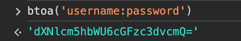

# Nexus Maven Version Checker

### inputs
**REPOSITORY** - Nexus repository name.  
**FORMAT** - Library format (ex. maven2, npm).  
**GROUP** - Library group id.  
**NAME** - Library name(or artifact id).  
**VERSION** - Search version.  
**NEXUS_HOST** - Nexus host url [http(or https)://{hostname}:{port}].  
**AUTH_BASE64** - Encoded(base64) username and password.   


### outputs
**is_component** - true or false.


### used

- Used with "keepbang/bump-tag-version".
- NEXUS_HOST and AUTH_BASE64 are used in secret.
- 

```
      - name: Bump tag version
        id: tag_version
        uses: keepbang/bump-tag-version@v1.0.1
        env:
          GITHUB_TOKEN: ${{ secrets.GITHUB_TOKEN }}
          WITH_V: false
          DEFAULT_BUMP: minor

      - name: Nexus library version checker
        id: checker
        uses: keepbang/nexus-version-checker@v0.0.1
        env:
          REPOSITORY: maven-releases
          FORMAT: maven2
          GROUP: com.demo
          NAME: employee-library
          VERSION: ${{ steps.tag_version.outputs.new_tag }}
          NEXUS_HOST: ${{ secrets.NEXUS_URL }}
          AUTH_BASE64: ${{ secrets.NEXUS_AUTH }}

```
